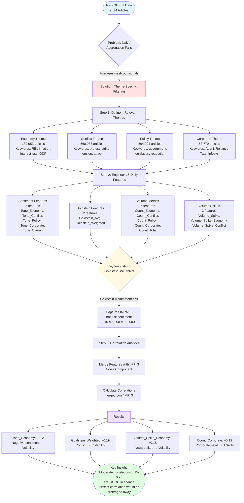
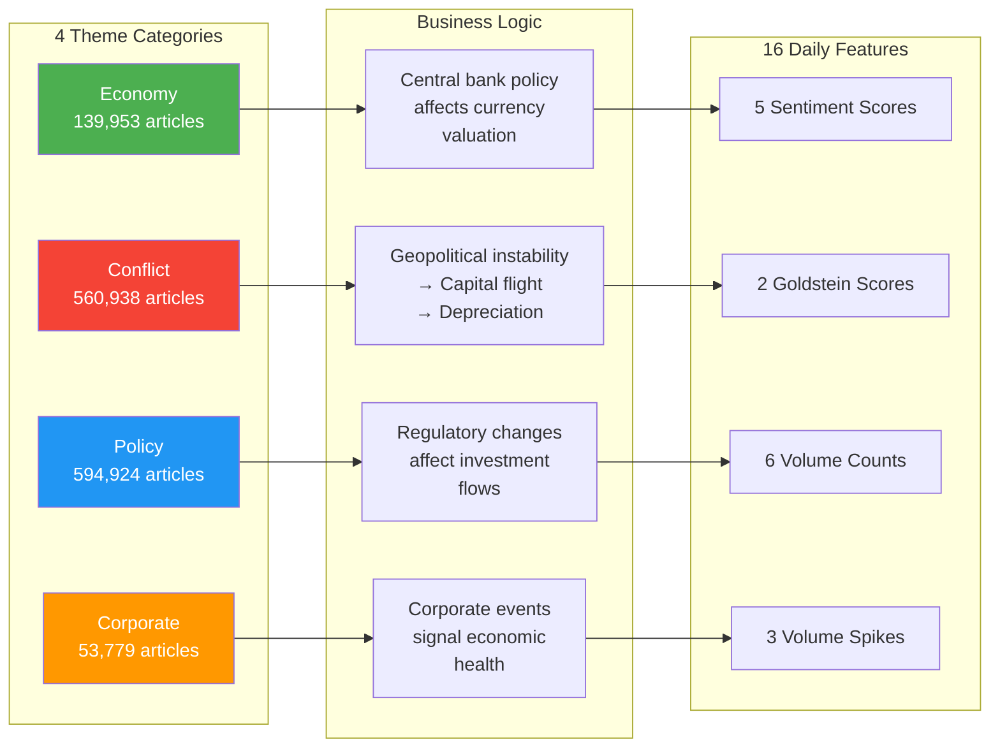
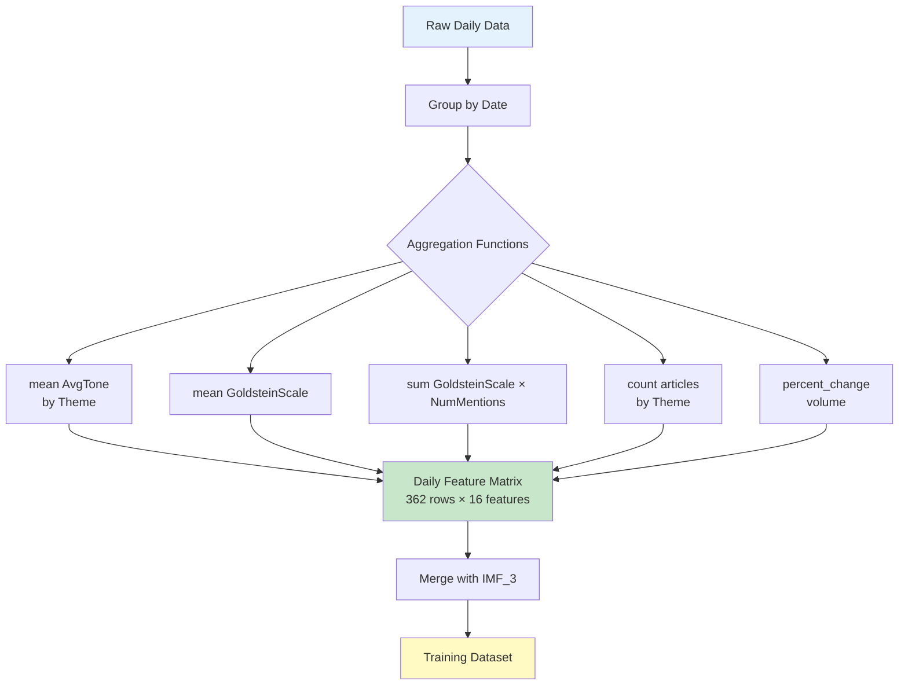
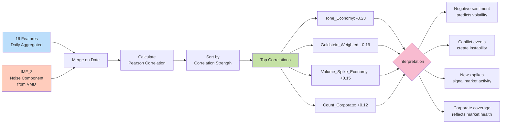
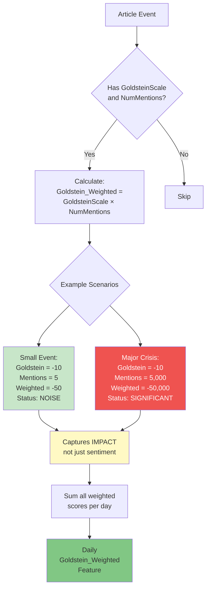

# Thematic Filtering Process - Flowchart

## Main Process Flow

## Detailed Theme Logic Flow

## Feature Engineering Pipeline

## Correlation Analysis Workflow

## Goldstein_Weighted Innovation

